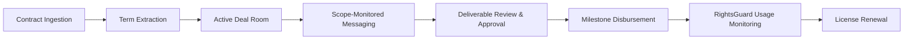

# Scope

A shared deal room platform for brands and creators to manage commercial agreements, communication, deliverable approvals, rights tracking, and milestone disbursements.

---

## About the Project

In creator marketing and commercial partnerships, collaborations are frequently negotiated over email, signed as static PDFs, and coordinated across informal messaging channels. This creates persistent operational challenges for both sides:

1. **Uncompensated Scope Creep**: Creators often receive informal requests in chat (additional cutdowns, extra hooks, re-edits, or format variations) that fall outside the agreed contract scope. Without an objective referee, creators either work for free or face awkward renegotiations.
2. **Untracked Commercial Rights**: Brands license content for specific durations (e.g., 30-day paid usage / Spark Ads), but tracking expiration dates manually is prone to error. Campaigns often continue running past their contractual window, creating legal liability for brands and depriving creators of extension revenue.
3. **Contract Disconnect**: Once an agreement is signed, key terms (deliverables, usage rights, exclusivity windows, revision caps) are locked in a PDF and rarely referenced during day-to-day execution.
4. **Delayed Approvals and Disbursements**: Deliverables and invoices are reviewed across disconnected tools, slowing down milestone sign-offs and payouts.

Scope solves this by converting static legal agreements into an active workspace. Key contract terms are extracted into living cards, conversations are audited in real time to catch scope adjustments before work is done, commercial usage is actively tracked with license extension options, and deliverables are tied directly to milestone releases.

---

## Target Audience

### Brands and Agencies
- Consolidates creator campaigns and roster agreements into centralized workspaces.
- Protects commercial compliance by enforcing organic vs. paid usage boundaries and license durations.
- Streamlines revision requests with auditable change requests and transparent budget approvals.

### Creators and Talent Managers
- Automatically flags informal client requests that exceed the contracted scope.
- Provides visibility into active commercial licenses and surfaces renewal opportunities when campaigns expire.
- Gives real-time transparency into milestone escrow releases and payment states.

---

## Agreement Lifecycle



1. **Contract Ingestion**: A brand uploads an agreement document or enters key partnership parameters.
2. **Term Extraction**: Gemini AI parses the document into structured terms (deliverables, exclusivity categories, usage duration, revision policies, payment milestones).
3. **Deal Room Collaboration**: Both parties access the shared deal room tailored to their respective roles.
4. **Scope-Monitored Messaging**: Communication takes place in the deal room. When a message contains an informal request outside the baseline agreement, the system flags it as a potential scope change with an estimated market fee and draft change request.
5. **Deliverable Review and Approval**: The creator submits work directly against contractual line items. The brand reviews, requests formal revisions, or approves.
6. **Milestone Disbursement**: Approvals unlock the associated milestone payment.
7. **Rights Management**: RightsGuard tracks commercial licensing windows and flags expired usage, enabling one-click renewals.

---

## System Architecture

```
CoolPractical/
├── backend/                  # FastAPI service with SQLModel and Gemini AI
│   ├── core/                 # Database configuration and connection setup
│   ├── models/               # Data models (Deal, Agreement, Message, ChangeRequest, etc.)
│   ├── routers/              # REST endpoints (deals, agreements, messages, users)
│   ├── services/             # Gemini API integration for extraction and scope auditing
│   └── requirements.txt
│
└── frontend/                 # Next.js 16 (App Router, Turbopack, React 19)
    ├── app/
    │   ├── context/          # UserContext (session, persona switcher, notifications)
    │   ├── components/       # UI components, modals, drawers, navigation
    │   ├── deals/[dealId]/   # Deal room modules (overview, agreement, messages, etc.)
    │   ├── login/            # Authentication and demo account selector
    │   └── lib/              # API client, TypeScript definitions, fallback data
    └── package.json
```

### Technology Stack

#### Frontend
- **Framework**: Next.js 16 (App Router, Turbopack)
- **Language**: TypeScript (Strict Mode)
- **Styling**: Tailwind CSS v4
- **Icons**: Lucide React
- **Typography**: Fraunces (serif headings) and Inter (sans-serif body/UI)
- **State & Session**: Client-side context with persistent `localStorage` hydration and zero-flash `AuthGuard`

#### Backend
- **Framework**: FastAPI (Python 3.11+)
- **ORM & Validation**: SQLModel / SQLAlchemy / Pydantic
- **AI Integration**: Google Gemini via `google-generativeai`
- **Database**: SQLite (Local development) / PostgreSQL (Production)
- **Production Host**: Render (`https://coolpractical.onrender.com`)

---

## Design System

The visual design combines high-contrast editorial typography with functional status accents:

| Token | Value | Application |
|---|---|---|
| Primary Purple | `#A05AFF` | Primary brand actions, active focus states, brand identity |
| Mint / Teal | `#1BCFB4` | Creator persona accent, live status indicator, success states |
| Supporting Cyan | `#4BCBEB` | Informational badges and secondary indicators |
| Coral Warning | `#FE9496` | Expiration alerts, error banners, and warning badges |
| Deep Violet | `#9E58FF` | Active sidebar navigation gradients |
| Workspace Cream | `#FBF9F5` | Main workspace background canvas |
| Deep Dark | `#0D0F11` | Sidebar and high-contrast dark panels |

---

## Core Capabilities

### Dual Persona Simulation
Users can toggle between perspectives via the top navigation bar:
- **Brand (`Northstar Coffee`)**: Review scope modification requests, approve submitted deliverables, release milestone payments, and issue license extensions.
- **Creator (`Amara Okafor`)**: Submit video deliverables, monitor message scope audits, check commercial licensing status, and view earned payouts.

### Gemini AI Scope Guardian and Term Extraction
- **Contract Extraction**: Automatically maps contract clauses to structured records (deliverables, usage rights, exclusivity, payment terms).
- **In-Flight Scope Auditing**: Analyzes message content asynchronously. If a message contains an uncontracted request (e.g., additional cutdowns or format changes), it classifies the message as a `scope_change`, suggests an appropriate fee adjustment, and allows one-click generation of a formal Change Request.

### RightsGuard Licensing Tracking
- Monitors commercial asset permissions across platforms (TikTok, Instagram, YouTube).
- Identifies active usages running past contracted dates and enables brands to renew licensing terms with updated duration and territory options.

### Responsive Mobile Interface
- Full mobile navigation via a slide-over drawer on screens under 768px.
- Overflow-safe tables, adaptive grid layouts, and touch-accessible modals.

---

## Local Development Setup

### Prerequisites
- Node.js 18.18+ or 20+
- Python 3.10+
- Google Gemini API Key (optional for local frontend mock testing, required for backend extraction)

### 1. Backend Setup

```bash
cd backend

# Create and activate virtual environment
python3 -m venv venv
source venv/bin/activate   # On Windows: venv\Scripts\activate

# Install dependencies
pip install -r requirements.txt

# Start the FastAPI server
uvicorn main:app --reload --port 8000
```

The API will be available at `http://localhost:8000`. Interactive documentation is available at `http://localhost:8000/docs`.

### 2. Frontend Setup

```bash
cd frontend

# Install dependencies
npm install

# (Optional) Point to local backend, defaults to cloud backend if omitted
export NEXT_PUBLIC_API_URL=http://localhost:8000

# Start development server
npm run dev
```

Open `http://localhost:3000` in your browser.

---

## Quality Checks and Verification

Run the following commands inside the `frontend/` directory before deploying:

```bash
# Lint check (enforces 0 errors and 0 warnings)
npm run lint

# TypeScript verification and production build
npm run build

# Start production server
npm run start
```

---

## Deployment Configuration

### Frontend (Vercel / Netlify / Render)
- **Framework**: Next.js
- **Root Directory**: `frontend`
- **Build Command**: `npm run build`
- **Output Directory**: `.next`
- **Environment Variables**:
  - `NEXT_PUBLIC_API_URL`: Optional custom backend URL (defaults to `https://coolpractical.onrender.com`)

### Backend (Render / Railway / Cloud Run)
- **Runtime**: Python 3.11+
- **Build Command**: `pip install -r requirements.txt`
- **Start Command**: `uvicorn main:app --host 0.0.0.0 --port $PORT`
- **Environment Variables**:
  - `GEMINI_API_KEY`: Google AI Studio API key

---

## License

Proprietary and confidential. Built for commercial deal room management.
