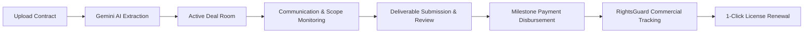

# AgreementOS 🤝

> **The Operating System for Creator Partnerships & Commercial Rights**  
> A shared, transparent deal room for Brands and Creators to collaborate on contracts, communications, deliverables, commercial licensing, and payments.

---

## 💡 What is AgreementOS?

**AgreementOS** is an intelligent collaboration platform designed specifically for commercial brand partnerships in the creator economy. 

Today, creator sponsorships are typically negotiated across scattered email threads, executed through dense legal PDFs that neither side refers back to, and managed through informal direct messages. This fragmented workflow introduces significant friction: creators perform uncompensated work due to subtle revision requests, brands inadvertently breach agreed licensing terms, and milestones are delayed by disconnected payment tools.

AgreementOS transforms static legal contracts into an **active, living workspace**. It bridges the gap between legal intent and day-to-day execution by:
1. Converting raw contract documents into structured, interactive term cards.
2. Providing an AI-powered **Scope Guardian** that audits conversations in real time to catch scope modifications before work goes unpaid.
3. Managing the lifecycle of commercial usage rights through **RightsGuard** to prevent expired advertisement usage and simplify license extensions.
4. Unifying communications, deliverable submissions, revisions, and milestone disbursements into a single audit-ready deal room.

---

## 🛑 The Problems It Solves

```
Contract Ingestion           Active Collaboration            Rights & Payouts
   [ Static PDF ]   ───►   [ AI Scope Guardian ]   ───►   [ RightsGuard ]
   Dense legal text        Protects against               Prevents expired ads
   becomes term cards      unpaid scope creep             & powers renewals
```

### 1. The "15-Page PDF" Disconnect
* **The Reality**: Contracts are signed via DocuSign and promptly archived in an email folder. When content production begins, neither creators nor brand managers re-read the fine print.
* **The Solution**: AgreementOS extracts the key obligations—deliverables, exclusivity categories, permitted channels, revision limits, and payment schedules—displaying them as persistent, scannable cards in the workspace.

### 2. "Revision Creep" & Scope Expansion
* **The Reality**: Brands frequently ask for *"just one more 15-second hook"*, *"a slightly different voiceover"*, or *"an extra cut for Instagram Stories"* via chat. Creators often comply to preserve the client relationship, leading to hours of unbilled work.
* **The Solution**: The integrated **Scope Guardian** (powered by Gemini AI) monitors communication in real time. When an informal message asks for work beyond the agreed terms, it alerts both parties, estimates fair compensation, and generates a formal, one-click **Change Request**.

### 3. Untracked Commercial Usage & Expired Rights
* **The Reality**: When a brand licenses creator content for 30 days of paid social media ads (whitelisting/spark ads), tracking that 30-day window is manual. Often, ads continue running past their contractual expiration date, exposing brands to legal liability and denying creators rightful licensing revenue.
* **The Solution**: **RightsGuard** tracks asset expiration dates, surfaces alerts for expired or unauthorized active campaigns, and provides an instant one-click renewal flow to extend duration and territory.

### 4. Fragmented Payouts & Approvals
* **The Reality**: Video feedback lives in Frame.io or Dropbox, approvals happen on Slack, and invoices sit in an accounts payable queue for 60 days.
* **The Solution**: Deliverables are submitted directly inside the deal room, reviewed against contract specs, and tied directly to milestone disbursements.

---

## 👥 Who AgreementOS Is Built For

### 🏢 Brands & Influencer Agencies
* **Centralized Operations**: Manage multiple creator rosters and active campaigns in standardized deal rooms.
* **Compliance Assurance**: Ensure marketing teams never breach organic vs. paid ad rights or post-term usage limits.
* **Frictionless Change Management**: Adjust project requirements with clear, auditable cost approvals instead of messy email back-and-forths.

### 🎨 Creators & Talent Managers
* **Scope Protection**: Stop working for free on uncontracted re-edits and extra cutdowns.
* **Rights Monetization**: Turn expired brand usages into lucrative licensing renewals.
* **Payment Transparency**: Clear visibility into escrow milestone releases and payment statuses.

---

## 🔄 The Deal Room Lifecycle



1. **Onboarding & Extraction**: The brand uploads an agreement or enters deal parameters. Gemini AI parses the text into structured terms.
2. **Active Deal Room**: Both parties access the shared deal room tailored to their respective roles.
3. **Smart Messaging**: Parties communicate; Gemini flags scope changes inline and recommends fair market pricing adjustments.
4. **Delivery & Sign-off**: The creator submits video links and raw files; the brand approves or submits formal revision notes.
5. **Milestone Release**: Funds are unlocked upon approval.
6. **Rights Monitoring**: Commercial usage status is actively tracked; expired licenses trigger renewal recommendations.

---

## 🎨 Visual Identity & Design System

AgreementOS is built around a modern, editorial aesthetic combining warm, human tones with crisp technical accents:

| Token | Value | Role |
|---|---|---|
| **Primary Purple** | `#A05AFF` | Primary brand accent, actions, brand badges |
| **Teal / Mint** | `#1BCFB4` | Creator accent, live status, successful states |
| **Supporting Cyan** | `#4BCBEB` | Informational badges, connectivity pills |
| **Coral Alert** | `#FE9496` | Warning, expired license badge, error pills |
| **Deep Violet** | `#9E58FF` | Active navigation gradients |
| **Brand Cream** | `#FBF9F5` | Workspace canvas background |
| **Brand Dark** | `#0D0F11` | Sidebar and high-contrast dark accents |
| **Serif Typography** | `Fraunces` | Prominent headings, deal titles, and financial sums |
| **Sans Typography** | `Inter` | Technical labels, metadata, body text, and inputs |

---

## 🏗️ Architecture & Tech Stack

```
CoolPractical/
├── backend/                  # FastAPI + SQLModel + Google Gemini AI
│   ├── core/                 # Database configuration & table setup
│   ├── models/               # SQLModel entities (Deal, Agreement, Message, etc.)
│   ├── routers/              # REST API endpoints (deals, agreements, messages, etc.)
│   ├── services/             # Gemini integration (scope check & term extraction)
│   └── requirements.txt
│
└── frontend/                 # Next.js 16 (Turbopack, App Router, React 19)
    ├── app/
    │   ├── context/          # UserContext (session, persona switcher, notifications)
    │   ├── components/       # Modals, drawers, navigation, cards, badges
    │   ├── deals/[dealId]/   # Deal room modules (overview, agreement, messages, etc.)
    │   ├── login/            # 1-click demo login & custom auth
    │   └── lib/              # API client, types, fallback demo datasets
    └── package.json
```

### Frontend
- **Framework**: Next.js 16 (Turbopack, App Router)
- **Language**: TypeScript (Strict Mode)
- **Styling**: Vanilla Tailwind CSS v4 + Custom Utility Palette
- **Icons**: Lucide React
- **Typography**: `@next/font/google` (`Fraunces` serif & `Inter` sans)
- **State & Auth**: Client-side context with persistent `localStorage` hydration and zero-flash `AuthGuard`

### Backend
- **Framework**: FastAPI (Python 3.11+)
- **ORM & Validation**: SQLModel / SQLAlchemy / Pydantic
- **AI Intelligence**: Google Gemini via `google-generativeai`
- **Database**: SQLite (Local) / PostgreSQL (Production)
- **Hosting**: Render (`https://coolpractical.onrender.com`)

---

## 🚀 Key Features

### 1. 🔀 Dual Persona Simulation
Switch instantly between **Brand** and **Creator** views using the persistent toggle in the top navbar:
- **Brand (`Northstar Coffee`)**: Approve deliverables, review scope modifications, disburse milestone payments, and issue license renewals.
- **Creator (`Amara Okafor`)**: Upload video deliverables, monitor real-time message audits, track RightsGuard licensing, and view incoming funds.

### 2. 🤖 Gemini AI Agreement Extraction & Scope Auditing
- **Agreement Extraction**: Parses raw legal contracts into structured term cards (Deliverables, Exclusivity, Usage Rights, Payment Schedule, Revisions).
- **Scope Guardian**: Automatically evaluates incoming chat messages. When extra work is requested (e.g. *"Can we add an extra TikTok cut?"*), Gemini flags the message as a `scope_change` with an estimated compensation fee and one-click Change Request drafting.

### 3. 🛡️ RightsGuard Licensing & Renewal
- Tracks active digital assets across YouTube, TikTok, and Instagram.
- Flags expired usage and provides an interactive renewal modal allowing brands to extend license duration and commercial territories.

### 4. 📱 Full Mobile Responsiveness
- Collapsible slide-over drawer navigation on screens `< 768px`.
- Touch-friendly action buttons, responsive modals, and horizontal-scroll containers for tables.

---

## 💻 Getting Started Locally

### Prerequisites
- **Node.js**: v18.18+ or v20+
- **Python**: v3.10+
- **Gemini API Key** (for backend AI features)

### 1. Start the Backend

```bash
cd backend

# Create and activate virtual environment
python3 -m venv venv
source venv/bin/activate   # On Windows: venv\Scripts\activate

# Install dependencies
pip install -r requirements.txt

# Run the FastAPI server
uvicorn main:app --reload --port 8000
```

Backend will be accessible at: `http://localhost:8000` (Interactive Swagger Docs: `http://localhost:8000/docs`).

### 2. Start the Frontend

```bash
cd frontend

# Install dependencies
npm install

# (Optional) Point to local backend, defaults to cloud backend if omitted
export NEXT_PUBLIC_API_URL=http://localhost:8000

# Start development server
npm run dev
```

Open `http://localhost:3000` in your browser.

---

## 🛠️ Scripts & Quality Checks

Run these commands inside the `frontend/` directory to verify code health:

```bash
# Type check & linting (0 errors, 0 warnings required)
npm run lint

# Production compilation test
npm run build

# Start production server
npm start
```

---

## 🌐 Deployment

### Frontend (e.g., Vercel, Netlify, Render)
- **Framework Preset**: Next.js
- **Root Directory**: `frontend`
- **Build Command**: `npm run build`
- **Output Directory**: `.next`
- **Environment Variables**:
  - `NEXT_PUBLIC_API_URL`: `https://coolpractical.onrender.com` (or your custom backend URL)

### Backend (e.g., Render, Railway, Fly.io)
- **Runtime**: Python
- **Build Command**: `pip install -r requirements.txt`
- **Start Command**: `uvicorn main:app --host 0.0.0.0 --port $PORT`
- **Environment Variables**:
  - `GEMINI_API_KEY`: Your Google AI Studio API key

---

## 📄 License
This project is proprietary and confidential. Created for commercial deal room management.
