# Scope

**The Operating System for Creator Partnerships, Real-Time Scope Auditing, and Commercial Rights.**

## The Problem

In modern creator commerce, agreements are negotiated over email or Instagram DMs, signed as static PDFs, and then promptly forgotten during execution. This causes friction for both parties:

1. **Uncompensated Scope Creep**: Informal client requests in chat ("*Could you also cut a vertical 15s teaser?*") go unbilled because creators dread uncomfortable renegotiations.
2. **Untracked Commercial Rights**: Content licensed for 30-day organic usage often continues running as paid Spark Ads or Meta Dark Posts past the expiration window, depriving creators of extension revenue and creating copyright exposure for brands.
3. **Contract Disconnect**: Legal clauses are locked inside PDF attachments, entirely divorced from daily deliverable workflows.
4. **Delayed Payouts**: Work is reviewed across disjointed drives and chat threads, delaying milestone disbursements.

---

## The Solution: Scope Deal Rooms

Scope turns static agreements into an **active collaboration deal room**:

```mermaid
graph LR
    A[PDF / Text Contract] -->|Gemini AI| B[Living Term Cards]
    B --> C[Active Deal Room]
    C -->|Real-Time Chat| D[ScopeGuard AI Audit]
    D -->|Scope Change Detected| E[One-Click Change Request]
    E -->|Approved & Paid| F[Milestone Escrow Release]
    F -->|RightsGuard Tracker| G[1-Click License Renewal]
```



- **Contract Ingestion**: Drop any agreement PDF or text. Scope's AI automatically extracts 6 structured living clauses (Scope, Deliverables, Financials, Revisions, Licensing, Restrictions).
- **ScopeGuard Active Listener**: Intercepts chat messages in real time. If a brand requests out-of-scope work, ScopeGuard highlights the clause reference, calculates a market fee estimate, and drafts a formal change request.
- **Change Request Engine**: Approve and pay extra work directly in-room; deal budgets and contract deliverables automatically update upon payment.
- **Deliverable Milestone Workflow**: Submit asset URLs directly against contractual line items. Brands review, request revisions against agreed caps, or approve to trigger payouts.
- **RightsGuard Commercial Licensing**: Tracks active organic and paid licensing windows, flags unauthorized or expired ad usage, and enables instant commercial extensions.

---

## End-to-End User Flow

```mermaid
sequenceDiagram
    autonumber
    actor Brand as Brand Manager (Nescafe Coffee)
    actor Creator as Creator (Amaka Moyinlola)
    participant Scope as Scope Platform
    participant Guard as ScopeGuard AI Engine

    Brand->>Scope: 1. Sign in as Brand & click "New Deal Room"
    Brand->>Scope: 2. Input campaign details (₦300,000 budget, Sept 1 - Oct 31)
    Brand->>Scope: 3. Upload contract PDF or enter key terms
    Scope->>Guard: 4. Parse & extract 6 living clause cards
    Guard-->>Scope: 5. Display Active Document banner & structured clauses
    Brand->>Creator: 6. Deal Room shared with Creator
    Brand->>Scope: 7. Message: "Could you also cut a quick YouTube Shorts version?"
    Scope->>Guard: 8. Real-time audit against contracted deliverables
    Guard-->>Scope: 9. Flag Scope Change (₦40,000 suggested fee)
    Brand->>Scope: 10. Click "Approve & Pay Change Request"
    Scope-->>Creator: 11. Deal total updates to ₦340,000; deliverables updated
    Creator->>Scope: 12. Submit video link for Review
    Brand->>Scope: 13. Approve deliverable
    Scope-->>Creator: 14. Milestone disbursement released
    Scope->>Brand: 15. RightsGuard Alert: 30-day organic window ending
    Brand->>Scope: 16. Click "Renew License" (30-day paid ad extension)
```

---

## Product Structure & Modules

| Route | Module | Purpose |
| :--- | :--- | :--- |
| `/` | **Landing Page** | Editorial presentation, product value proposition, dual persona preview |
| `/login` | **Authentication** | Sign up and sign in with fast demo account switchers (`Nescafe Coffee` / `Amaka Moyinlola`) |
| `/deals/[id]` | **Deal Room Chat** | Real-time messaging with integrated **ScopeGuard** AI auditing and change request generation |
| `/deals/[id]/agreement`| **Living Contract** | Active document source banner, 6 structured term cards, source evidence inspection |
| `/deals/[id]/deliverables`| **Deliverables Hub** | Asset submission URLs, revision counters against agreed caps, approval status |
| `/deals/[id]/changes` | **Change Requests** | Formal pending, approved, and settled scope change requests with payment checkout |
| `/deals/[id]/licensing` | **RightsGuard** | Organic vs. paid ad tracking, expiration countdowns, violation simulator, license renewals |
| `/deals/[id]/activity` | **Audit Ledger** | Immutable chronological record of all contract updates, approvals, and settlements |
| `/deals/[id]/payments` | **Financial Overview**| Summary of baseline compensation, approved change fees, and payout schedule |

---

## Local Development Quickstart

### Prerequisites
- **Node.js**: v18.18+ or v20+
- **Python**: v3.9+
- **macOS / Linux / Windows WSL**

### 1. Backend Setup

```bash
# Navigate to backend
cd backend

# Create and activate virtual environment
python3 -m venv .venv
source .venv/bin/activate       # On Windows: .venv\Scripts\activate

# Install all dependencies
pip install -r requirements.txt

# Start local backend server (port 8000)
uvicorn main:app --reload --port 8000
```
- API will be live at: `http://localhost:8000`
- Interactive Swagger docs: `http://localhost:8000/docs`
- Health check: `http://localhost:8000/health`

### 2. Frontend Setup

```bash
# In a new terminal, navigate to frontend
cd frontend

# Install dependencies
npm install

# Start Next.js development server
npm run dev
```
- Frontend will be live at: `http://localhost:3000`
- **Auto-Negotiating Connectivity**: If your local Python server is running on `localhost:8000`, the frontend connects to it with zero configuration. If the local backend is stopped, it automatically falls back to the live cloud backend on Render!

---

## Quality Verification & Tests

```bash
# Type check backend (0 errors enforced)
/Users/fiopefoluwaorekoya/.antigravity-ide/extensions/meta.pyrefly-1.3.1-darwin-arm64/bin/pyrefly check

# Type check frontend (0 errors enforced)
cd frontend && npx tsc --noEmit

# Lint frontend
cd frontend && npm run lint

# Production build
cd frontend && npm run build
```

---

## Technology Stack

- **Frontend**: Next.js 15 (App Router, Turbopack), TypeScript, Tailwind CSS, Lucide Icons, Fraunces serif typography + Inter sans-serif.
- **Backend**: FastAPI, SQLModel ORM, Pydantic v2, PyPDF, bcrypt, PyJWT, WebSockets.
- **AI & Extraction**: Google Gemini 2.5 Flash SDK (`google-genai`) with resilient offline heuristic regex engine.
- **Cloud Infrastructure**: Vercel Edge (Frontend) + Render Web Service (FastAPI Backend) + SQLite / PostgreSQL.

---

## License
MIT License. Built for commercial creator partnerships and deal room management.
